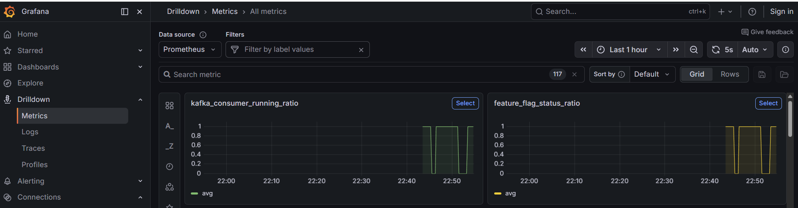

# Azure App Configuration + Kafka Consumer Integration

This repository contains a Spring Boot application that dynamically manages a Kafka consumer's lifecycle based on a feature flag hosted in Azure App Configuration.

## Key Features
- **Dynamic Kafka Consumer**: Automatically starts and stops the Kafka listener based on feature flag status.
- **Azure App Configuration**: Uses Azure App Configuration for centralized feature management and dynamic configuration.
- **Observable Metrics**: Capture feature flag state and Kafka consumer running status with OpenTelemetry.

---

## Prerequisites
- **Java 17+**
- **Docker & Docker Compose**
- **Azure CLI**
- **Maven**

---

## Azure Setup

Use the following Azure CLI commands to set up the required resources.

### 1. Create a Resource Group
```bash
az group create --name <resource-group> --location <region>
```

### 2. Create the App Configuration Store
```bash
az appconfig create --name <resource-name> --resource-group <resource-group> --location <region> --sku Free
```

### 3. Create the Feature Flag
```bash
az appconfig feature set --name <resource-name> --feature <feature-name> --yes
```

### 4. Get the Connection String
```bash
az appconfig credential list --name <resource-name> --resource-group <resource-group> --query "[?name=='Primary'].connectionString" -o tsv
```

---

## Local Setup

### Environment Variables
The following environment variables are required in `docker-compose.yml`:

| Variable | Description | Example |
| :--- | :--- | :--- |
| `APP_CONFIG_CONNECTION_STRING` | Connection string for your Azure App Config store | `Endpoint=https://...;Id=...;Secret=...` |
| `FEATURE_FLAG_NAME` | The name of the feature flag to monitor | `enable-kafka-consumer` |
| `KAFKA_BOOTSTRAP_SERVERS` | Kafka broker endpoint (internal or external) | `kafka:29092` |
| `KAFKA_TOPIC_NAME` | The Kafka topic to consume from | `test-topic` |
| `KAFKA_CONSUMER_GROUP` | The consumer group ID | `test-group` |

### Running with Docker Compose
To start the entire stack (Kafka, App):

```bash
docker compose up -d --build
```

To rebuild the application if code changes:
```bash
docker compose build app-instance && docker compose up -d
```

---

## Verification

### 1. Root Endpoint
Verify the application is healthy and the `RootController` is working:
```bash
curl -i http://localhost:8080/
# Should return "204 No Content"
```

### 2. Dynamic Toggle
1. Toggle the feature flag on in the Azure Portal or via CLI:
   ```bash
   az appconfig feature enable --name <resource-name> --feature <feature-name>
   ```

   -or- 

   Toggle the feature flag off in the Azure Portal or via CLI:
   ```bash
   az appconfig feature disable --name <resource-name> --feature <feature-name>
   ```

2. Monitor the application logs:
   ```bash
   docker compose logs -f app-instance
   ```

   Depending on the state of the Kafka consumer you should see one of:

   `Feature flag '<feature-name>' is ON, but Kafka listener is STOPPED. Starting listener...`

   `Feature flag '<feature-name>' is OFF, but Kafka listener is RUNNING. Stopping listener...`

   `Kafka listener state matches feature flag. (Flag: ON=true/false, Running=true/false)`

### 3. Observability
- **Kafka UI**: `http://localhost:8081` - Submit messages to Kafka topics.
- **Grafana**: `http://localhost:3000` - View real-time metrics and dashboards.
  - **Login**: None required (Anonymous access enabled)
  - **Metrics**: 



---

## Implementation Details

The application uses a `@Scheduled` task in `KafkaLifecycleScheduler.java` to check for feature flag changes every 10 seconds. Under the hood, the Azure App Configuration SDK will check every 30 seconds, returning cached values in the meantime.

If the feature flag is enabled then the Kafka listener is started if not already running.

If the feature flag is disabled then the Kafka listener is stopped if not already stopped.

### Metrics
Two OpenTelemetry Asynchronous Gauges are registered:
- `feature_flag_status_ratio`: Indicates if the feature flag is enabled (1) or disabled (0) as viewed from the perspective of the service.
- `kafka_consumer_running_ratio`: Indicates if the Kafka consumer is running (1) or stopped (0).
- Metrics are submitted every 60 seconds

These metrics are recorded with labels such as `host.name`, `listener.id`, and `listener.group` for granular observability across multiple instances.
